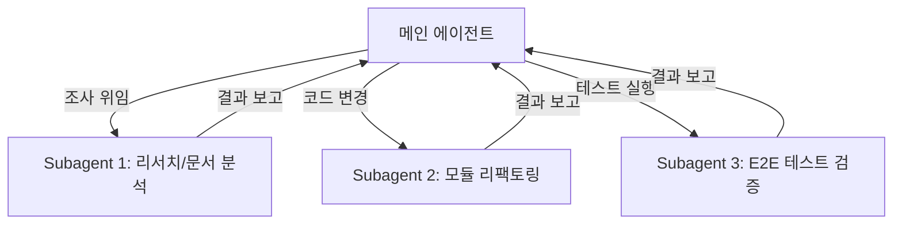

# 🚀 Google Antigravity 에이전트 활용 가이드 (Antigravity Agent Guide)

이 문서는 **Google Antigravity (AGY)** AI 코딩 에이전트를 프로젝트에서 최대 성능으로 활용하기 위한 종합 실전 가이드입니다. 에이전트의 주요 기능, 명령 체계, 워크플로우, 프롬프트 작성 법 및 베스트 프랙티스를 담고 있습니다.

---

## 📌 목차
1. [개요 및 특징](#1-개요-및-특징)
2. [핵심 기능 및 스래시 명령 (Slash Commands)](#2-핵심-기능-및-스래시-명령-slash-commands)
3. [에이전트 아키텍처 및 커스터마이징](#3-에이전트-아키텍처-및-커스터마이징)
   - [Skills (스킬)](#skills-스킬)
   - [Rules (규칙)](#rules-규칙)
   - [Subagents (서브에이전트 오케스트레이션)](#subagents-서브에이전트-오케스트레이션)
4. [표준 개발 워크플로우 (Standard Workflow)](#4-표준-개발-워크플로우-standard-workflow)
5. [효과적인 프롬프트 작성 가이드](#5-효과적인-프롬프트-작성-가이드)
6. [베스트 프랙티스 및 주의사항](#6-베스트-프랙티스-및-주의사항)

---

## 1. 개요 및 특징

**Google Antigravity**는 자율적이고 지능적인 AI 페어 프로그래밍 및 에이전틱 코딩 프레임워크입니다. 단순한 코드 완성을 넘어, 에이전트가 코드베이스를 스스로 탐색하고 분석하며, 멀티 에이전트 협업 및 백그라운드 태스크를 통해 복잡한 프로젝트를 수행합니다.

### 💡 주요 핵심 역량
- **자율 코드베이스 탐색 & 리서치**: 리포지토리 전체를 검색(Grep/List), 파일 분석, 의존성 관계 파악
- **멀티 에이전트 오케스트레이션**: 특화된 서브에이전트(Subagents)를 생성하여 리서치/개발/테스트를 병렬 처리
- **비동기 백그라운드 태스크 실행**: 장시간 소요되는 빌드/테스트/서버 실행을 비동기로 처리하고 완료 시 자동 알림
- **아티팩트(Artifacts) 기반 인터렉션**: 단순 텍스트 답변이 아닌 계획서(`implementation_plan.md`), 요약보고서(`walkthrough.md`), 다이어그램 등 정제된 문서 제공

---

## 2. 핵심 기능 및 스래시 명령 (Slash Commands)

채팅창에서 아래 스래시 명령어를 입력하여 에이전트에게 특정 특화 모드나 인터랙션을 요청할 수 있습니다.

| 슬래시 명령어 | 명칭 | 사용 시점 및 역할 |
| :--- | :--- | :--- |
| `/goal` | **장기 목표 실행 모드** | 야간 작업이나 장시간 자율 모드. 에이전트가 목표 달성 시까지 멈추지 않고 스스로 철저히 검증 및 완수 |
| `/grill-me` | **심층 심사/인터뷰 모드** | 개발 시작 전 의도, 설계 결정, 아키텍처 선택에 대해 에이전트가 사용자에게 역질문하여 요건 명확화 |
| `/browser` | **브라우저 자동화 모드** | 웹 자동화, E2E UI 테스트, 웹 리서치 및 외부 웹 애플리케이션 인터랙션 필요 시 사용 |
| `/schedule` | **타이머 / 반복 태스크** | 일회성 타이머 설정 또는 주기적 크론(Cron) 작업 스케줄링 |
| `/teamwork-preview` | **팀워크/멀티에이전트 모드** | 대규모 프로젝트 수행 시 여러 에이전트가 역할을 나누어 협업하는 시뮬레이션 및 수행 |
| `/learn` | **피드백 학습 및 영구 저장** | 에이전트에게 전달한 피드백/설정/수정사항을 스킬이나 규칙으로 영구 반영하여 다음 작업에 적용 |

---

## 3. 에이전트 아키텍처 및 커스터마이징

Antigravity 에이전트는 프로젝트 및 조직의 특성에 맞춰 행동 및 커스텀 로직을 확장할 수 있습니다.

### Skills (스킬)
특정 워크플로우나 반복 작업 지침을 담은 모듈식 커스텀 지침입니다.
- **글로벌 스킬**: `C:\Users\<User>\.gemini\config\skills\<skill_name>\SKILL.md`
- **프로젝트 스킬**: `.agents/skills/<skill_name>/SKILL.md`

> [!TIP]
> **스킬 생성 예시**: `/learn` 명령을 사용하거나 직접 `SKILL.md` 파일을 작성하여 팀 고유의 코드 리뷰 체크리스트, 배포 자동화 절차 등을 등록할 수 있습니다.

### Rules (규칙)
에이전트가 항상 준수해야 하는 코딩 스타일, 보안 지침, 프로젝트 제약 조건입니다.
- **경로**: `.agents/rules/` 폴더 내 `.md` 파일 또는 프로젝트 루트의 `AGENTS.md` / `GEMINI.md`

```markdown
# 프로젝트 규칙 예시 (AGENTS.md)
- 모든 API 반응형 인터페이스는 HSL 커스텀 컬러 패브릭을 사용합니다.
- 함수 생성 시 JSDoc 타입 주석을 필수로 포함해야 합니다.
- 절대 불필요한 외부 라이브러리를 추가하지 말고 Vanilla JS 및 표준 API를 우선 고려합니다.
```

### Subagents (서브에이전트 오케스트레이션)
에이전트는 독립된 컨텍스트를 가진 서브에이전트를 생성(`invoke_subagent` / `define_subagent`)하여 복잡한 작업을 효율적으로 분담합니다.



---

## 4. 표준 개발 워크플로우 (Standard Workflow)

안티그래비티 에이전트와의 성공적인 협업 프로세스는 4단계로 구성됩니다.

```
┌─────────────────┐     ┌─────────────────┐     ┌─────────────────┐     ┌─────────────────┐
│ 1. 계획 (Plan)  │ ──> │ 2. 승인 (Review)│ ──> │ 3. 실행 (Exec)  │ ──> │ 4. 검증 (Verify)│
└─────────────────┘     └─────────────────┘     └─────────────────┘     └─────────────────┘
```

### 1단계: 조사 및 계획 (Research & Implementation Plan)
- 에이전트가 코드베이스를 탐색하고 변경 범위를 분석합니다.
- `implementation_plan.md` 아티팩트를 생성하여 설계안과 변경될 파일 목록, 검증 계획을 제안합니다.

### 2단계: 사용자 검토 및 승인 (User Review)
- 사용자는 제출된 계획서(`implementation_plan.md`)를 확인하고, 수정 의견을 주거나 승인(Proceed) 버튼을 누릅니다.

### 3단계: 작업 실행 (Execution)
- 에이전트가 가이드라인과 기존 코드를 준수하여 파일 수정/생성을 진행합니다.
- 빌드, 서버 실행, 테스트 명령을 비동기 태스크로 실행합니다.

### 4단계: 실측 검증 및 요약 (Verification & Walkthrough)
- 에이전트는 작성된 코드에 대해 실제 테스트나 빌드 명령을 수행하여 성공을 검증합니다.
- 완료 후 `walkthrough.md` 아티팩트를 작성하여 변경 내역과 검증 결과를 보고합니다.

> [!IMPORTANT]
> 에이전트는 테스트나 명령 실행을 통해 성공 결과(Empirical verification)를 확인하기 전까지 절대로 "작업 완료"를 선언하지 않습니다.

---

## 5. 효과적인 프롬프트 작성 가이드

에이전트로부터 원하는 최고의 결과를 얻기 위한 프롬프트 작성 팁입니다.

### ❌ 피해야 할 프롬프트 (모호함)
> "로그인 기능 좀 고쳐줘."  
> "웹 앱 디자인을 예쁘게 만들어줘."

### ✅ 추천하는 프롬프트 (명확한 조건 및 컨텍스트)
> "로그인 시 JWT 토큰 만료 에러가 처리되지 않는 문제를 수정해줘.  
> 1. `auth.js` 파일의 refreshToken 로직을 확인해줘.  
> 2. 토큰 만료 시 `/login`으로 리다이렉트 처리하고 알림 모달을 띄워줘.  
> 3. 수정 후 단위 테스트를 실행해서 통과하는지 보여줘."

### 🎯 핵심 프롬프트 패턴 4가지
1. **역할 및 목표 명시**: 무엇을 만들거나 수정하려 하는지 구체적으로 기술
2. **제약 조건 기술**: "TailwindCSS 사용 금지", "기존 API 하위 호환성 유지" 등
3. **단계별 지시**: 작업을 단계별로 분할하여 요청
4. **검증 방식 지정**: "작성 후 `npm test`를 실행하여 통과 여부를 검증해 줘"

---

## 6. 베스트 프랙티스 및 주의사항

> [!WARNING]
> **데이터 안전 준수**: `DROP TABLE`, `rm -rf`, 프로덕션 리소스 삭제와 같은 파괴적 명령어 실행 시 에이전트가 승인을 요청하도록 지침이 설정되어 있습니다.

> [!TIP]
> **성능 최적화 팁**:
> - **대규모 탐색**: 리포지토리 구조 파악 시 `/goal` 모드나 리서치 서브에이전트를 활용하세요.
> - **의도 명확화**: 아키텍처 구상 단계에서 `/grill-me`를 활용해 역질문을 받으면 시행착오를 대폭 줄일 수 있습니다.
> - **규칙 재사용**: 반복적으로 수정하는 스타일에 대해서는 프로젝트 루트에 `AGENTS.md`를 만들어 등록해 두세요.

---
*문서 작성일: 2026-08-06*  
*제작: Antigravity AI Assistant*
